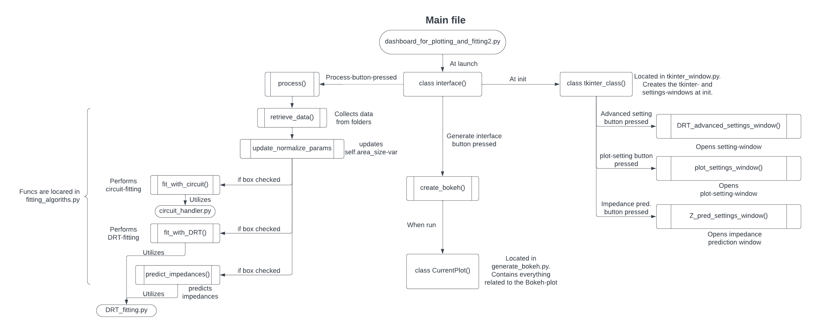
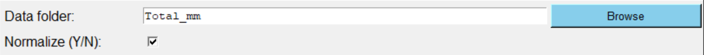
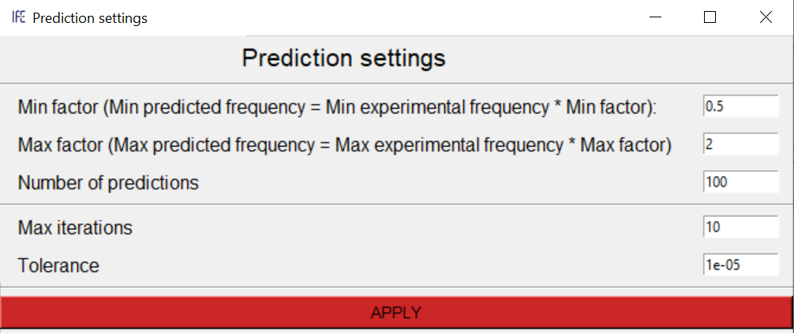
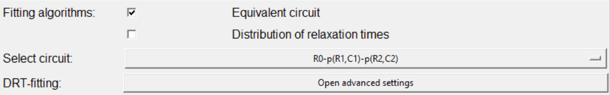
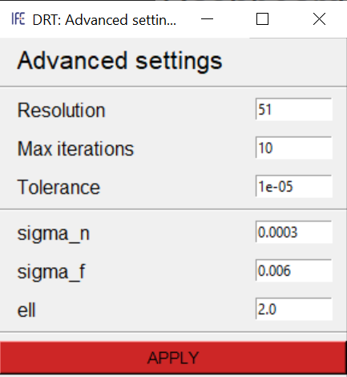
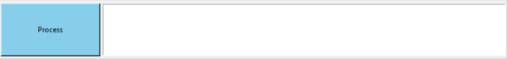
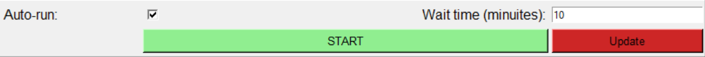
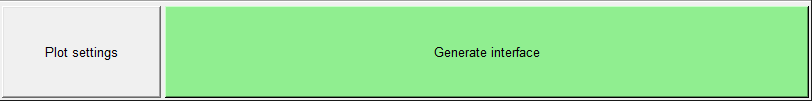
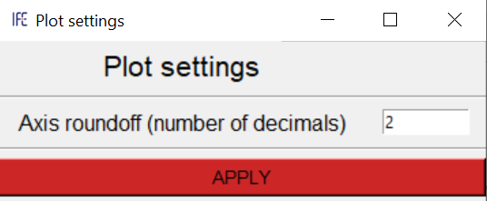

# Dashboard for visualizing and fitting data
## Purpose and use
After measuring og fitting using `control_main.py`, there is created numerous files consisting of frequencies and the corresponding impedance. In order to verify and study the results, it is convenient to visualize it in a dashboard where one can filter what data is shown.

Moreover, it can be insightful to perform a fitting of the data. In particular, one can do this using an *Equivalent-circuit* or a *Distribution of Relaxation Times*-method [1]. The two methods a different pros and cons, and it would therefore be ideal to perform both of them.

The following program can be used for all these purposes, and allows the user to perform one or mroe of the following actions:
- Retrieve and normalize data from the directory where it was saved.
- Create a Bokeh-dashboard that can be saved as a `.html`-file.
- Plot impedances for the different cells in Nyquist- and Bode-plots.
- Fit data using an *Equivalent-circuit-method* [3], and plot the resulting values for resistances, capacitances and caharacteristic frequencies.
- Fit data using a *Distribution of Relaxation TImes*, and plot the results.
- Retrieve new data and perform calculations automatically after a set amount of time.
- Save calculiations from fitting to a local computer, and plot the results at a later time.

## Schematic of program-structure

Launch by running the `dashboard_for_plotting_and_fitting.py`-file, or directly from within the `control_main`-window.

## How to use
Every section of the dashboard will we displayed with a short explanatory text.

### Import data


Press *Browse* to choose the directory where the data is placed, and check or uncheck the *Normalize (Y/N)*-checkbox based on whether you want to normalize the data and fittings or not.

### Predict impedance 

**Note: Recommended to read the *Distribution of Relaxation Times (DRT)*-section before this one in order to better understand the theoretical explanations.**

When assuming that the *DRT* is a Gaussian process, it implies that the estimated impedance $Z^{DRT}$ given as $Z^{DRT}(f) = 2\pi i fL_{0} + R_{\infty} + \int_{-\infty}^{\infty}\frac{\gamma(\xi)}{1 + 2\pi if\tau}d\xi$ is also a Gaussian process. This is because a linear transformation of a multivariate normal distribution also has a multivariate normal distribution. This implies that by finding estimating the *DRT* for a spesified frequency-range, one can also predict the impedances on the same frequency range by applying a linear transformation to the *DRT*. In addition, since we have calculated the distribution of the predicted impedances, we can also find the standard deviation for each predition. The frequency range is neither required to lie within the range of the measured frequencies, meaning that by using this method for prediction, we can predict impedances outside of the measured frequency range (extrapolation). 

For a more mathematical reasoning for the prediction works for an unmeasured log-frequency $\xi' = \log f'$, we note that the joint distribution between the *DRT* $\gamma$ (from the measured frequencies), the impedance $Z_{im}^{exp}$ (from the measured frequencies) and the predicted $\left(\gamma(\xi'), Z_{im}^{DRT}(\xi') \right)$ (from the unmeasured frequency) follows a multivariate Gaussian distribution. This multivariate Gaussian distribution is given as $\left(\gamma, Z_{im}^{exp}, \gamma(\xi'), Z_{im}^{DRT}(\xi')\right)^{T} \sim N\left(0,\Sigma\right)$, where the matrix $\Sigma$ in given in equation (23) in [1]. Thus, it follows directly from our knowledge of linear statistics that 

```math
\begin{pmatrix}
Z_{im}^{exp} \\
Z_{im}^{DRT}(\xi') 
\end{pmatrix}  \sim N\left(0, \begin{pmatrix}
L_{im}^{2}K + \sigma_{n}^{2}I & L_{im}^{2}K(\xi, \xi') \\
L_{im}^{2}K(\xi, \xi')^{T} &L_{im}^{2}k(\xi', \xi')
\end{pmatrix}\right)
```
Therefore $Z_{im}^{DRT}(\xi')$, i.e., the imaginary part of the impedance predicted at the unmeasured log-frequency $\xi'$, is an random variable. Conditioning on the experimental data yields the distribution 

$$Z_{im}^{DRT}(\xi')\mid Z_{im}^{exp} \sim N\left(\mu_{Z_{im'}^{DRT}}, \Sigma_{Z_{im'}^{DRT}}\right)$$
with $\mu_{Z_{im'}^{DRT}} = L_{im}^{2}K(\xi, \xi')^{T}\left(L_{im}^{2}K + \sigma_{n}^{2}I\right)^{-1}Z_{im}^{exp}$ and $\Sigma_{Z_{im'}^{DRT}} = L_{im}^{2}k(\xi', \xi') - L_{im}^{2}k(\xi, \xi')^{T}\left(L_{im}^{2}K + \sigma_{n}^{2}I\right)^{-1}L_{im}^{2}k(\xi, \xi')$. 
This will result in the predicted value and standard deviation for the umbeasured log-frequency $\xi'$. In a similar way, one can also find the distribution of $\gamma(\xi')\mid Z_{im}^{exp}$.

One caveat is that the current *DRT*-method only fits the imaginary part of the experimental impedances, which means that one can only predict the imaginary part of the impedances. In this program, we have attempted to solve this by utilizing the *Kramers–Kronig* relations. Explanined simply, the *Kramers-Kronig* relations are a set of mathematical rules that connect the real and imaginary parts of a complex function. If you know one part—let's say the real part—you can use the *Kramers-Kronig* relations to find out something about the imaginary part, and vice versa. This means that we can use the fact that we have estimated the imaginary part of the impedance-spectrum, in order to also predict the real part of the spetrum. The *Kramers–Kronig* relations is calculated using the `validation.linKK`-function within the `impedance`-package. This is done in the `predict_impedance`-function within `DRT_fitting.py`.


Use interpolation and extrapolation to estimate impances for unmeasured frequencies. Check the checkbox to do perform this prediction while processing. Press the *Open settings*-button to open the settings-window.



In this window, one can choose the settings that the determines the range and amount of impedances that are predicted. 
- *Min factor*: Determines hos far the prediction will go below (or above) the lowest measured frequency. The lowest frequency used for prediction will be the product of the lowest measured frequency and the *Min factor*.
- *Max factor*: Determines hos far the prediction will go above (or below) the highest measured frequency. The highest frequency used for prediction will be the product of the lowest measured frequency and the *Max factor*.
- *Number of predictions*: Detemines the number of predicted impedances that will be generated.
- *Max iterations*: The maximum number of iterations before terminating the scipy.minimize-function in the function `predict_impedance_DRT_calculation` withing the `DRT_fitting.py`-file.
- *Tolerance*: The tolerance for when the scipy.minimize-function in the function `predict_impedance_DRT_calculation` withing the `DRT_fitting.py`-file will stop automatically.

Note:
>The frequencies used for prediction will be distibuted logarithmically. Currencly, the frequencies are created in the following way:  `freqs = np.logspace(np.log10('Min factor' * 'Min measured freq'), np.log10('Max factor' * 'Max measured freq'), 'Number of predictions', endpoint=True)`.

### Fitting algorithms


Check or uncheck the two checkboxed based on whether or not you with to perform the fitting algorithm. 

**Equivalent-circuit:**

When performing fitting with *Equivalent circuit*, choose your preferred circuit in the dropdow-menu. With this method, each element of the circuit is supposed to correspond to a physical characteristic of the system under study. Choose the circuit based on you konowledge of the physical system you are studying, or in a more *ad hoc* fashion. Be aware that this fit in not neccesarily unique, meaning that different circuits can fit the data equally well. 

After finding the parameters for the equivalent circuit [4], the analytical impedances are automatically calculated based on these values. These impedances are plotted in the *Nyquist*- and *Bode*-plots. When determining the parameters, their standard-deviation is also calculated and added to the *Resistance*-, *Capacitance*- and *Characteristic frequency*-plots.

**Distribution of Relaxation Times (DRT):**

Brief summary of theory (read more in article [1]): 
>The *DRT* model assumes that the voltage response of an electrochemical system to a step current perturbation decays exponentially with a particular distribution of timescales. When this hypothesis holds, then the impedance can be written as

$$Z^{DRT}(f) = 2\pi i fL_{0} + R_{\infty} + \int_{-\infty}^{\infty}\frac{\gamma(\xi)}{1 + 2\pi if\tau}d\xi$$

>where $L_{0}$ is the inductance, $L_{\infty}$ is the resistance and $\gamma(\xi)$ with vector $\xi = \log f$ is the DRT that the algorithm determines. By interpreting the DRT (and therefore also $Z^{DRT}$) as an unseen (or latent) Gaussian process, we can predict the DRT by correlating $\gamma(\xi)$, $Z^{DRT}$ and the experimental data. It is, by conditioning the $\gamma$ at the log-frequencies (which is a Gaussian Random vaiable) with respect to the imaginary part of the experimental impedance (notated as $Z_{im}^{exp}$), possible to estimate the *DRT*-distribution $\gamma(\xi)$. This can be calculated using the formulas
$$\gamma\mid Z_{im}^{exp} \sim N\left(\mu_{\gamma\mid Z_{im}^{exp}},\Sigma_{\gamma\mid Z_{im}^{exp}} \right)$$
$$\mu_{\gamma\mid Z_{im}^{exp}} = L_{im}K\left(L_{im}^{2}K + \sigma_{n}^{2}I\right)^{-1}Z_{im}^{exp}$$
$$\Sigma_{\mu_{\gamma\mid Z_{im}^{exp}}} = K - L_{im}K\left(L_{im}^{2}K + \sigma_{n}^{2}I\right)^{-1}L_{im}K^{T}$$
```math
\left(K\right)_{nm} = k(\xi_{n}, \xi_{m}) \stackrel{\text{model assumption}}{=} \sigma_{f}^{2}exp\left(-\frac{1}{2l^{2}}(\xi_{n}-\xi_{m})^{2} \right)
```
```math
\left(L_{im}K\right)_{nm} = \mid L_{\xi'}^{im}\left(k(\xi, \xi') \right) \mid_{\xi_{n}, \xi_{m}}
= \mid \int_{\infty}^{\infty} \frac{2\pi e^{\xi' - \xi_{hat}}}{1 + \left(2\pi e^{\xi' - \xi_{hat}}\right)^{2}} k(\xi, \xi')\mid_{\xi_{n}, \xi_{m}}
```
 
> In order to get the best results, it is nesseccary to determine the optimal hyperparameters $\theta = (\sigma_{n}, \sigma_{f},l)$. The optimal hyperparameters are the ones that maximices the marginal likelihood $p(Z_{im}^{exp} \mid \xi, \theta)$, ie. the $\theta$ that yield the highest probability of getting the same result as the emperimental/measured data. Equivalent to maximizing  $p(Z_{im}^{exp} \mid \xi, \theta)$ is minimizing the marginal log-likelihood $L(\theta) =  -\log p(Z_{im}^{exp} \mid \xi, \theta) - \frac{N}{2}\log 2\pi$, so in our method we will find the optimal hyperparameters $\theta = arg\min_{\theta'} L(\theta')$.

In our case, to determine the optimal hyperparameters, we will minimize $L$ using the *Nelder Mead*-algorithm with some self-determined bounds. Still, it is worth experimenting with other algorithms to check what yields the bests results for the particular data. Note that although the *Nelder Mead*-algorithm is not gradient-based method, the gradient has been computed analytically (see (79) in [1]). This means that it is also possible to use gradient-based methods. See [2] for all the possible algorithms that the `scipy.optimize.minimize`-function can utilize.



When performing fitting with *DRT*, the settings selected in the *Advances settings*-window can drasticcaly impact the speed and accuracy of the result. Press the 'Open advanced settings*-button to open the window. 
- *Resolution*: The amount of samples in the frequency range used for prediction. Higher resolution yields a smoother plot.
- *Max iterations*: The maximum number of iterations before terminating the scipy.minimize-function in `DRT_fitting.py`.
- *Tolerance*: The tolerance for when the scipy.minimize-function in `DRT_fitting.py` will stop automatically.

It is also possible to choose the initial hyperparameters:
- *sigma_n*: Noise level (unknown). This is the level of the random error that is supposed to affect the measured impedance in our model. See equation (16) in [1].
- *sigma_f*: Constraint on the covariance (see (1)).
- *ell*: Constraint on the covariance (see (1))

    Note: The default starting values for the hyperparameters have been chosen based on expermentation, and the best values can vary between datasets.   
    
    (1) While during the data analysis phase there is little control over the experimental data, all hyperparameters can be chosen, including the  covariance. Constrain the covariance to be on the form of the squared exponential $k(\xi, \xi')=\sigma_{f}^{2}exp\left(-\frac{1}{2l^{2}}(\xi-\xi')^{2} \right)$


After choosing the preferred settings, press the *APPLY*-button to initialize the settings.

Suggested improvements to improve the method:
- Current mathematical framework only fits the *imaginary* part of the expermimental impedance. See section (2.3.5) in [1] for an explanaition of why this is the case. As of 08.08.2023, not simple solution to this problem has been implemented. Yet, the authours of the article [1] suggested a methology for tackling this issue, see (4.1) in [1].
- Have not enforced any constraint on the DRT, meaning we can get negative values for the *DRT*-distribution. See section (4.2) in [1] for a suggestion of how to solve this issue.
- Current implementation assumes a squared exponential covariance, but this is not neccecarily the case.  See section (4.3) in [1].


### Process


Press the *Process*-button to begin retrieving and fitting the data. Status-updates will be printed in the text-panel to the right.

### Auto-run


Instead of pressing the *Process*-button, one can insead utilize the auto-run-feature. This will repeatedly retrieve data from the selected folder and perform new fittings after a spesified amount of time. 


Check the checkbox and choose the preferred amout of waiting time (in minuites). Start the process by pressing the *START*-button. Every time a new retrieving and fitting has been performed, the *Update*-button will turn green. Press this button to generate a new Bokeh-dashboard with plots using the newest data.  

### Save to folder 


After processing the data, it is possible to save the calculations to a spesified folder. Preferrably the folder must be empty, thus avouding any chance of overwriting other files. Choose a folder with the *Browse*-button, and remember to save the data by pressing the *SAVE*-button.

### Load previous data


If calculations have previously been saved to a folder using the *Save to folder*-function, is is possible to retrieve and plot this data wihout doing any further calculations. Press the *Browse*-button to select the folder where the data was saved, and press the *USE PREV DATA*-button to initialize this data. If one instead wants to perform new calculations, press the *CLEAR*-button to de-initialize the previous data.

### Generate interface


After processing or initializing previous data, press the *Generate interface*-button to create a Bokeh-dashboard that displayes the plots. This dasboard will be saved with the filename `dashboard_for_plotting_and_fitting2.html` in the current directory. 



Before creating the plot, press the *Plot settings*-button to open a window where you can choose more advanced settings for the look and behavoiur of the dashboard.
- *Axis roundoff*: The number of decimals that till be displayed in the axes of the plots. Note that the number of decimals can increace when zooming.

After choosing the preferred settings, press the *APPLY*-button to initialize the settings.

## Dependencies
`numpy`

`tkinter`

`pandas`

`bokeh`

`scipy`

`impedance`

## References
1. Liu, J., & Ciucci, F. (2019). The Gaussian process distribution of relaxation times: A machine learning tool for the analysis and prediction of electrochemical impedance spectroscopy data. Electrochimica Acta, 135316. [[sciencedirect.com/science/article/pii/S0013468619321887]](https://www.sciencedirect.com/science/article/pii/S0013468619321887)
2. Scipy-documentation (2023). [[docs.scipy.org/doc/scipy/reference/generated/scipy.optimize.minimize.html]](https://docs.scipy.org/doc/scipy/reference/generated/scipy.optimize.minimize.html)
3. Wikipedia (2023). Equivalent circuit. [wikipedia.org/wiki/Equivalent_circuit](https://en.wikipedia.org/wiki/Equivalent_circuit)
4. Bio-Logic Science Instruments (2019). EC-Lab – Application Note #60. [biologic.net/battery-eis-distribution-of-relaxation-times-drt_electrochemistry-an60.pdf](https://www.biologic.net/wp-content/uploads/2019/08/battery-eis-distribution-of-relaxation-times-drt_electrochemistry-an60.pdf)